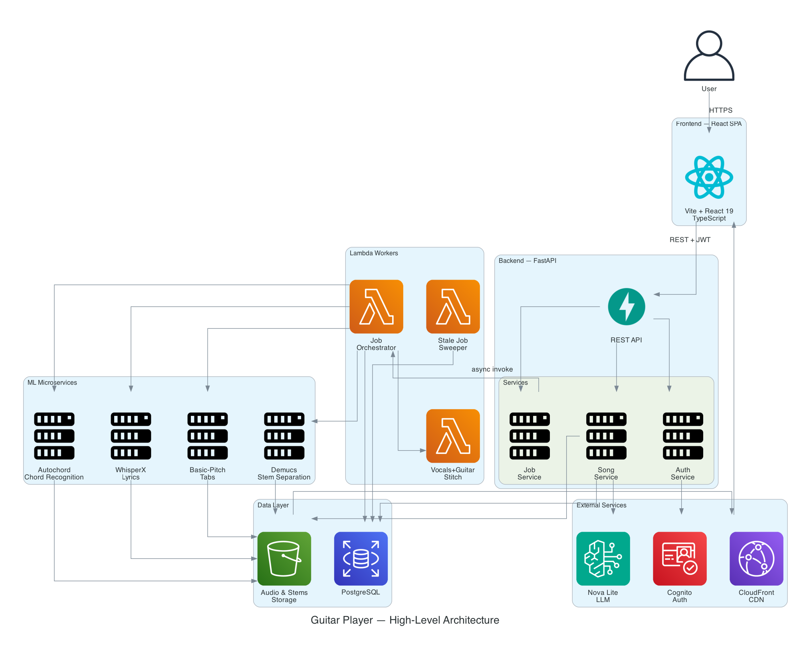
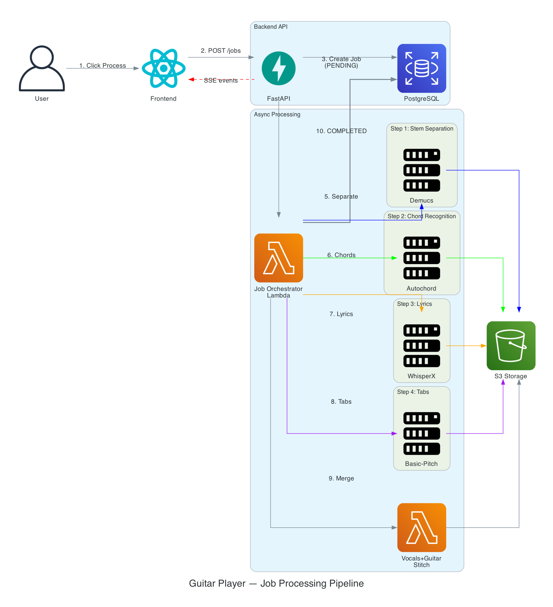
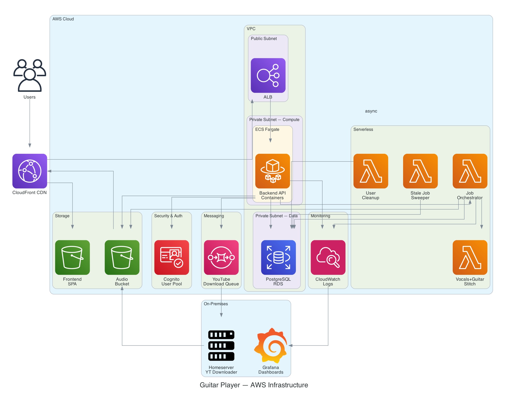

# Guitar Player — Architecture Overview

A full-stack application that lets users search YouTube for songs, download them, separate audio into stems (vocals, guitar, drums, bass), recognize chords, transcribe lyrics with word-level timestamps, generate guitar tabs, and play everything back in sync.

---

## Project Structure

```
guitar_player/
├── backend/              # FastAPI REST API — core business logic
├── frontend/             # React + TypeScript SPA (Vite)
├── lyrics_generator/     # WhisperX-based lyrics transcription service
├── inference_demucs/     # Demucs audio source separation service
├── chords_generator/     # Autochord-based chord recognition service
├── tabs_generator/       # Basic-pitch guitar tablature service
├── homeserver/           # On-premises YouTube downloader
├── infra/                # Terraform AWS infrastructure
├── grafana/              # Observability dashboards
└── scripts/              # Deployment automation
```

---

## Tech Stack

| Layer | Technology |
|-------|-----------|
| Frontend | React 19, TypeScript, Vite, Tailwind CSS, Radix UI, Zustand, TanStack Query, WaveSurfer.js |
| Backend | FastAPI, Python 3.13, SQLAlchemy 2.0 (async), Mangum (Lambda adapter) |
| Auth | AWS Cognito (email/password + Google OAuth), JWT |
| Database | PostgreSQL 15+ (RDS) |
| Storage | S3 (prod) / local filesystem (dev) |
| Processing | Demucs, Autochord, WhisperX, basic-pitch |
| AI/LLM | AWS Bedrock Nova Lite (metadata parsing), OpenAI Whisper |
| Infra | AWS ECS Fargate, Lambda, SQS, CloudFront, Terraform |
| Monitoring | CloudWatch, Grafana |

---

## High-Level Architecture



---

## Database Schema

| Table | Key Columns |
|-------|------------|
| **users** | `id` (PK), `cognito_sub` (UK), `email`, `trial_ends_at` |
| **songs** | `id` (PK), `youtube_id` (UK), `song_name` (UK), `title`, `artist`, `genre`, `audio_key`, `vocals_key`, `guitar_key`, `chords_key`, `lyrics_key`, `tabs_key`, `processing_job_id` (FK→jobs) |
| **jobs** | `id` (PK), `user_id` (FK→users), `song_id` (FK→songs), `status`, `progress`, `stage`, `results` (JSON) |
| **favorites** | `id` (PK), `user_id` (FK→users), `song_id` (FK→songs) |
| **subscriptions** | `id` (PK), `user_id` (FK→users), `provider`, `status`, `plan_type`, `expires_at` |

**Relationships:** users → jobs (1:N), users → favorites (1:N), users → subscriptions (1:N), songs → jobs (1:N), songs → favorites (1:N)

---

## Core Flows

### Job Processing Pipeline



**Steps:**
1. User clicks "Process" in the frontend
2. Frontend sends `POST /api/v1/jobs` to the backend
3. Backend creates a Job record (status=PENDING) in PostgreSQL
4. Backend asynchronously invokes the Job Orchestrator Lambda
5. Lambda calls Demucs for stem separation (vocals, guitar, drums, bass)
6. Lambda calls Autochord for chord recognition
7. Lambda calls WhisperX for lyrics transcription (word-level timestamps)
8. Lambda calls Basic-Pitch for guitar tab generation
9. Lambda merges vocals + guitar stems
10. Job marked as COMPLETED — frontend receives update via SSE

**Authentication Flow:**
- Register → Cognito sign_up → confirmation email → confirm_sign_up → create User (14-day trial)
- Login → Cognito admin_initiate_auth → returns JWT tokens → stored in Zustand
- All API calls include Bearer token; automatic refresh via axios interceptor

**Playback Experience:**
- WaveSurfer.js audio player with stem switching (vocals, guitar, full mix)
- Chord sheet, lyrics display, and guitar tabs all synced to current playback position
- Auto-scroll follows the music in real time

---

## Frontend Architecture

### Feature Modules

| Module | Pages | Key Components | State |
|--------|-------|---------------|-------|
| **Auth** | Login, Register, Confirm Email, Callback, Profile | LoginForm, RegisterForm, ConfirmEmailForm, AuthGuard | `auth.store` |
| **Search** | SearchPage | SearchInput, ResultsList | React Query |
| **Library** | LibraryPage, FavoritesPage | SongLibrary, SongCard, FavoritesList | React Query |
| **Player** | SongDetailPage | AudioPlayer, ChordSheet, LyricsDisplay, TabsSheet, JobProgressMonitor | `playback.store`, `player-prefs.store` |
| **Subscription** | SuccessPage, FailPage | SubscriptionGuard | `subscription.store` |

### Routes

```
/login              → Public
/register           → Public
/confirm-email      → Public
/callback           → OAuth callback
/search             → Auth + Subscription required
/library            → Auth + Subscription required
/favorites          → Auth + Subscription required
/song/:id           → Auth + Subscription required
/profile            → Auth required
/subscription/*     → Auth required
```

### State Management (Zustand)

- **auth.store** — tokens, user identity, login/logout
- **subscription.store** — trial status, active subscription
- **playback.store** — current song, position, playing state
- **player-prefs.store** — capo, transpose, display preferences
- **song-media-cache.store** — cached presigned URLs for stems
- **job-watcher.store** — background job progress tracking

---

## Backend Architecture

### API Endpoints

| Router | Endpoints | Purpose |
|--------|-----------|---------|
| `/auth` | register, login, confirm, refresh, me | Authentication |
| `/songs` | search, select, get, stream | Song management |
| `/jobs` | create, get, events (SSE) | Job orchestration |
| `/favorites` | list, toggle | User favorites |
| `/subscription` | status, checkout, webhook | Payments |
| `/admin` | heal, reprocess | Admin operations |
| `/health` | check | Health check |

### Services

- **SongService** — YouTube search, download, LLM metadata parsing
- **JobService** — Job creation, Lambda invocation, status tracking
- **YoutubeService** — yt-dlp wrapper (search + download)
- **LlmService** — Bedrock Nova for song metadata extraction
- **ProcessingService** — Dispatches to Demucs/Chords/Lyrics/Tabs services
- **CognitoAuthService** — Cognito user pool operations
- **SubscriptionService** — Trial + paid subscription management
- **TelegramService** — Error notifications

---

## ML Microservices

| Service | Port | Technology | Input | Output |
|---------|------|-----------|-------|--------|
| **Demucs** | 8000 | Demucs 4, PyTorch | Audio file | Separated stems (vocals, guitar, drums, bass, piano, other) |
| **Chords** | 8001 | Autochord, PyChord | Audio file | Chord timeline with simplification levels + capo suggestions |
| **Lyrics** | 8003 | WhisperX, Genius API | Audio file | Word-level timestamped lyrics |
| **Tabs** | 8004 | basic-pitch, librosa | Guitar audio | String/fret mappings with confidence scores |

---

## Infrastructure (AWS)



---

## Key Design Decisions

1. **Async job processing** — Heavy ML workloads run in Lambda workers, not in the API process
2. **SSE for real-time updates** — Job progress streams to the frontend without polling
3. **Processing lock** — `song.processing_job_id` prevents duplicate concurrent jobs on the same song
4. **Stale job detection** — Jobs idle >16 minutes are auto-marked as FAILED
5. **Microservice separation** — Each ML model runs as an independent HTTP service for independent scaling
6. **Storage abstraction** — S3 in production, local filesystem in development, same interface
7. **Payment provider abstraction** — Protocol-based design supports AllPay and Paddle
8. **Admin healing** — Missing stems/chords/lyrics are automatically repaired on song access
9. **LLM metadata enrichment** — YouTube titles are parsed by Bedrock Nova to extract clean artist/song/genre
10. **Word-level lyrics sync** — WhisperX + Genius alignment enables karaoke-style highlighting
