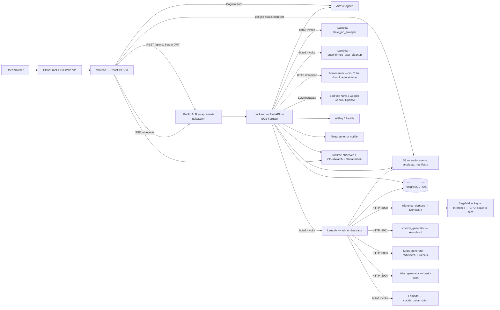
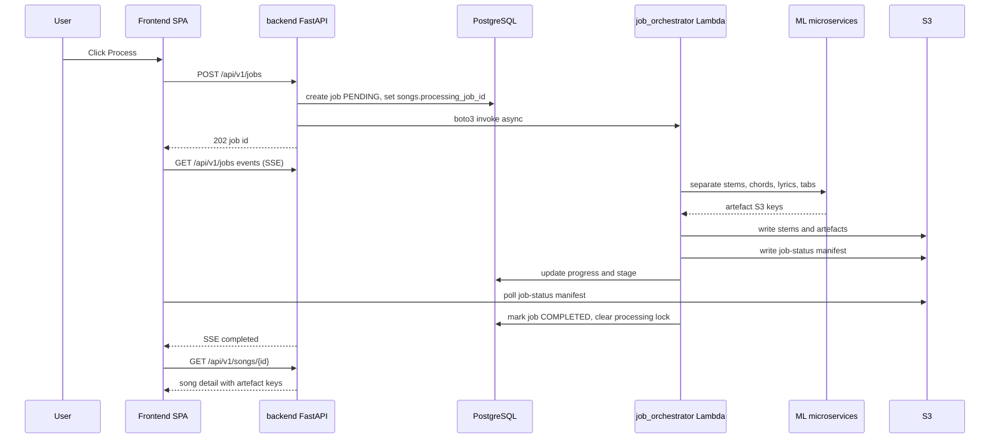
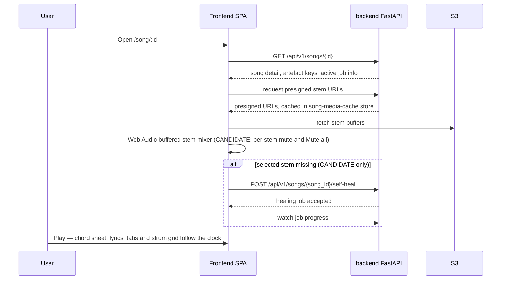
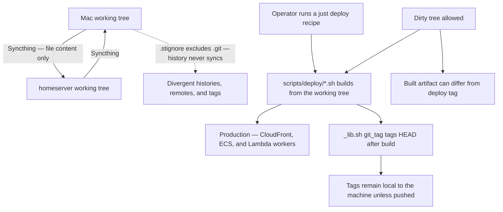

# Architecture — guitar_player

## System Overview

A hybrid system: one FastAPI backend (deployed as a **container task on ECS
Fargate behind a public Application Load Balancer**) is the single front door
for a React SPA, and all heavy work is pushed out to four independent ML HTTP
microservices, four container Lambda workers, and one on-premises sidecar.
PostgreSQL (RDS) is the sole database; S3 holds every audio and derived
artefact. Infrastructure is Terraform across eight modules.

## Architectural Style

**Container-fronted hybrid microservices**, with evidence:

- *Container front door* — `infra/modules/ecs/main.tf` defines
  `aws_ecs_task_definition.backend` and `aws_ecs_service.backend`;
  `scripts/deploy/backend.sh` calls `deploy_ecs_container_image`; and
  `api.smart-guitar.com` resolves to a public ALB.
  `backend/src/guitar_player/main.py` wires all nine routers and *also* exports
  a Mangum handler (with `awslambdaric` pinned), but that is a compatibility /
  dead deployment path — the backend does **not** run on Lambda or API Gateway.
- *Microservices* — `inference_demucs` (:8000), `chords_generator` (:8001),
  `lyrics_generator` (:8003), `tabs_generator` (:8004) each ship their own
  `pyproject.toml`, `uv.lock`, `Dockerfile`, tests, and `API.md`. They are
  independently deployable (`just deploy-demucs`, `deploy-chords`,
  `deploy-lyrics`, `deploy-tabs`).
- *Worker Lambdas* — `backend/src/guitar_player/lambdas/` holds
  `job_orchestrator`, `stale_job_sweeper`, `unconfirmed_user_cleanup`,
  `vocals_guitar_stitch`, each with a dedicated Dockerfile and `just deploy-*`
  recipe.
- *Hybrid on-prem* — `homeserver/youtube_downloader.py` runs off-AWS so YouTube
  downloads do not originate from AWS IP ranges.
- *Not a monolith* — the alternative (all processing inside the API process) is
  contradicted by GPU/SageMaker Async Inference usage and the Lambda size limits
  the container images work around.

## Component Relationships

<!--
PLAIN-TEXT FALLBACK — Component relationships.
The user browser loads the React SPA from CloudFront over S3. The SPA talks to
the FastAPI backend over REST /api/v1 with a Bearer JWT and receives job events
over SSE; it also polls an S3 job-status manifest directly and authenticates
against AWS Cognito. The backend owns PostgreSQL RDS and S3, calls Cognito,
invokes three Lambdas by boto3 (job_orchestrator, stale_job_sweeper,
unconfirmed_user_cleanup), calls the on-prem homeserver sidecar for YouTube
downloads, calls Bedrock Nova / Google GenAI / OpenAI for metadata, and talks to
AllPay/Paddle and Telegram. The job_orchestrator Lambda calls the four ML
microservices over HTTP (demucs :8000, chords :8001, lyrics :8003, tabs :8004),
invokes the vocals_guitar_stitch Lambda, and writes to S3 and the database.
Demucs is backed by SageMaker Async Inference with scale-to-zero. Both the SPA
and the backend emit telemetry to runtime-observer, CloudWatch, and Grafana/Loki.
-->

## Data Flow

1. **Ingest** — SPA `POST /api/v1/songs/search` → backend → `youtube_service.py`
   (yt-dlp + bgutil PO-token provider) → homeserver sidecar downloads audio →
   `raw/{youtube_id}.wav` in S3. LLM parses the title into artist/song/genre.
2. **Process** — SPA `POST /api/v1/jobs` → backend creates a `jobs` row
   (`status=PENDING`), sets `songs.processing_job_id` as a lock, and invokes the
   orchestrator Lambda asynchronously.
3. **Fan-out** — the orchestrator calls demucs → chords → lyrics → tabs, writing
   `processed/{job_id}/{desc}_{target|residual}.wav` and artefact keys back onto
   the `songs` row, then stitches vocals + guitar.
4. **Report** — progress reaches the SPA on three channels: SSE stream, REST
   polling of `/api/v1/jobs/{id}`, and the S3 job-status manifest
   (`job_status_manifest.py` ↔ `use-job-status-manifest.ts`).
5. **Play** — SPA fetches presigned URLs (cached in `song-media-cache.store`) and
   mixes stems client-side in a Web Audio buffered stem mixer; chord sheet,
   lyrics, tabs, and strum grid are driven off the same playback clock.
6. **Repair candidate** — the uncommitted SPA calls
   `POST /api/v1/songs/{song_id}/self-heal` when a selected stem is missing.
   This is not in current production; operators currently use `/api/v1/admin`.

## Interaction Diagrams

### Business transaction 1 — "Process a song end to end"

<!--
PLAIN-TEXT FALLBACK — Process a song end to end.
The user clicks Process; the SPA posts to /api/v1/jobs. The backend creates a
PENDING job row, sets songs.processing_job_id as a processing lock, invokes the
job_orchestrator Lambda asynchronously, and returns the job id. The SPA opens the
SSE event stream. The orchestrator calls the ML microservices for stems, chords,
lyrics and tabs, writes the artefacts and a job-status manifest to S3, and
updates progress and stage in the database. The SPA also polls the S3 manifest as
a second progress channel. When the orchestrator marks the job COMPLETED and
clears the processing lock, the SSE stream reports completion and the SPA fetches
the song detail with its artefact keys.
-->

### Business transaction 2 — "Play a song, repair a missing stem" (CANDIDATE reconciled flow — **NOT current production**)

> **Scope label.** The per-stem mute / `Mute all` batch control and the
> client-triggered `POST /api/v1/songs/{song_id}/self-heal` call in this diagram
> exist **only in the uncommitted working tree**. The direct fetch of the current
> production frontend asset contains `instrumentConsole` but contains none of
> `Mute all`, `Unmute all`, `track-selector-toggle-all`, `Self-healing started`,
> or `Could not start self-healing`. Treat this diagram as the candidate flow
> after reconciliation, not as deployed behaviour. The current production play
> path is: fetch song detail → presigned stem URLs → Web Audio buffered stem
> mixer, with **no** mute batch control and **no** client-triggered self-heal.

<!--
PLAIN-TEXT FALLBACK — Play a song and repair a missing stem.
The user opens the song detail route. The SPA fetches the song detail, then
requests presigned stem URLs which it caches in song-media-cache.store, and pulls
the stem buffers from S3 into a Web Audio buffered stem mixer. On play, the chord
sheet, lyrics, tabs and strum grid are all driven off the same playback clock.
CANDIDATE-ONLY, NOT CURRENT PRODUCTION: the per-stem mute plus Mute all batch
control, and the branch where a missing selected stem makes the SPA post to
/api/v1/songs/{song_id}/self-heal and watch the resulting healing job. Those
exist only in the uncommitted working tree; the direct production asset check
found instrumentConsole but none of Mute all, Unmute all, track-selector-toggle-all,
Self-healing started, or Could not start self-healing.
-->

### Business transaction 3 — "Ship a change to production" (current, defective)

<!--
PLAIN-TEXT FALLBACK — Ship a change to production, current defective flow.
The Mac and homeserver working trees are kept in sync by Syncthing, but .stignore
excludes .git, so file content syncs while histories, remotes, and tags do not.
Deploy scripts build from the current working tree and tag HEAD afterward without
requiring a clean tree. A dirty build can therefore differ from its deploy tag,
and machine-local tags are invisible to the other clone until explicitly pushed
or fetched. Current homeserver component tags plausibly match the distinguishing
production evidence, but the process does not guarantee provenance.
-->

## Key Design Decisions

1. **Async job processing** — heavy ML runs in Lambda workers and SageMaker, not
   in the API process. Alternative rejected: in-process processing, blocked by
   Lambda duration limits and lack of GPU.
2. **Three progress channels** (SSE, REST polling, S3 manifest) — resilience
   against Lambda/API-Gateway SSE timeouts, at the cost of three code paths that
   must agree (this over-complexity is visible in `ProcessButton.tsx`).
3. **Processing lock via `songs.processing_job_id`** — prevents duplicate
   concurrent jobs; creates a circular FK with `jobs.song_id`.
4. **Client-side stem mixing with Web Audio** — the documented `wavesurfer.js`
   was replaced by a custom 583-line buffered stem mixer; the docs were not
   updated.
5. **On-prem YouTube sidecar** — mitigates YouTube bot checks against AWS IPs.
   Alternative rejected: proxy vendor.
6. **Explicit self-heal over implicit healing** — the uncommitted change replaced
   unconditional background healing on every `GET /songs/{id}` with a client-
   triggered endpoint, removing per-page-load repair cost.
7. **Storage abstraction** — S3 in production, local filesystem in development.
8. **Terraform-only IaC**, eight modules, no CloudFormation/CDK.

## Architectural Risks

- **Deploy provenance is unenforced.** Scripts build the working tree and tag
  `HEAD` afterward without a clean-tree check. Current homeserver-local tags
  plausibly match the distinguishing production evidence, but dirty deploys can
  still produce artifacts that differ from their tags.
- **Uncommitted feature loss.** Stem mute controls and `self-heal` have no git
  ancestor. A checkout, reset, or clean can lose them unless committed or backed
  up; this session created `/tmp/guitar-player-before-reconcile-20260816-230659`.
- **Syncthing-mediated source divergence.** `.stignore` excludes `.git`, so two
  machines share file content but not histories, remotes, or tags. `.gitignore`
  also excludes `.claude/`, so the AI-DLC runtime files are local.
- **Local Terraform state** (`infra/terraform.tfstate` in-tree) — the same
  divergence hazard applied to infrastructure, across two synced machines.
- **No CI.** Nothing enforces lint, typecheck, or tests before a deploy.
- **Circular FK** `songs.processing_job_id` ↔ `jobs.song_id` blocks clean table
  ordering and raises an SAWarning on teardown.

## Improvement Opportunities

- Make the deploy artefact provenance-true: build from a committed tree, and tag
  the built commit rather than HEAD.
- Remove the source checkout from Syncthing; use Git between independent clones.
- Commit the reconciled working tree before any history-changing operation.
- Move Terraform state to a remote backend.
- Introduce a minimal CI gate (`just lint-frontend`, `just test`, `npx tsc -b`).
- Reduce the three progress channels to one authoritative channel plus a fallback.
