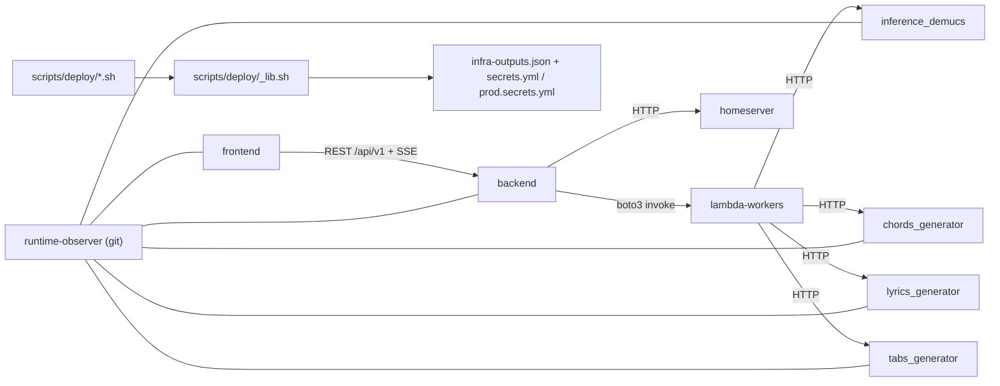

# Dependencies — guitar_player

## Internal Cross-Package Dependencies

<!--
PLAIN-TEXT FALLBACK — Internal dependencies.
The frontend depends on the backend over REST /api/v1 and SSE. The backend
invokes the lambda-workers via boto3 and calls the homeserver sidecar over HTTP.
The lambda-workers call the four ML services (inference_demucs, chords_generator,
lyrics_generator, tabs_generator) over HTTP. Every deploy script sources
scripts/deploy/_lib.sh, which reads infra-outputs.json and secrets.yml or
prod.secrets.yml. The runtime-observer git package is shared by the frontend, the
backend, and all four ML services.
-->

| From | To | Mechanism |
|---|---|---|
| `frontend` | `backend` | REST `/api/v1` + SSE, axios with Bearer refresh |
| `frontend` | S3 | direct poll of the job-status manifest; presigned stem URLs |
| `backend` | `lambda-workers` | boto3 async invoke |
| `backend` | `homeserver` | HTTP (YouTube download off AWS IPs) |
| `backend` | the 4 ML services | HTTP (ports 8000 / 8001 / 8003 / 8004) |
| `lambda-workers` | the 4 ML services | HTTP fan-out from `job_orchestrator` |
| `scripts/deploy/*.sh` | `scripts/deploy/_lib.sh` | shared bash lib → `infra-outputs.json`, `secrets.yml` / `prod.secrets.yml` |
| `just deploy-all` | `scripts/deploy/all.sh` | per-component deploy scripts |

## Shared Third-Party Dependency: `runtime-observer`

Consumed by **five packages** — `frontend` (npm
`github:germanilia/runtime-observer`) and `backend` + all four ML services
(Python `git+…/runtime-observer#subdirectory=python-sdk`) — in **every case via
an unpinned git ref** (no tag, no SHA). Consequences:

- Builds are not reproducible; an upstream push changes what five packages get.
- The frontend maintains a hand-written ambient declaration
  (`frontend/src/types/runtime-observer.d.ts`) for it, so the type contract is
  local and can silently desync from upstream.

## External Runtime Dependencies

| Category | Services |
|---|---|
| Media | YouTube (`yt-dlp` + `bgutil` PO-token provider) |
| LLM | AWS Bedrock Nova, Google GenAI, OpenAI |
| Music data | Genius, Ultimate Guitar (`ug_chord_fetcher.py`), Tavily |
| Identity | AWS Cognito |
| Payments | AllPay, Paddle |
| Ops | Telegram (error notifications), CloudWatch, Grafana / Loki |
| AWS platform | ECS Fargate + public ALB (backend API runtime), Lambda (the four workers), ECR, SQS, CloudFront, RDS PostgreSQL, S3, SageMaker Async Inference |

## Version Drift Across the Python Packages

Independent `uv.lock` files with no shared constraint file:

| Package | Divergent pins |
|---|---|
| `fastapi` | 0.129.0 in backend / demucs / chords / lyrics vs **0.130.0** in tabs |
| `boto3` | 1.42.53 in backend / demucs / chords vs **1.42.54** in lyrics / tabs |
| `numpy` | 2.2.6 in demucs / chords vs **1.26.4** in tabs |
| `openai` | 2.21.0 in backend vs **2.24.0** in lyrics |
| `curl_cffi` | `>=0.15.0` in backend vs `==0.14.0` in lyrics — a direct conflict |

## Dependency Risks

1. **Unpinned `runtime-observer` git ref × 5 packages** — no reproducible build.
2. **`curl-cffi >=0.15.0`** is the backend's only unpinned runtime dependency and
   contradicts `lyrics_generator`'s exact `0.14.0`.
3. **Version drift** across five independently locked Python services.
4. **Local Terraform state** (`infra/terraform.tfstate` + `.backup` in-tree) —
   the same divergence hazard as source, on two Syncthing-linked machines.
