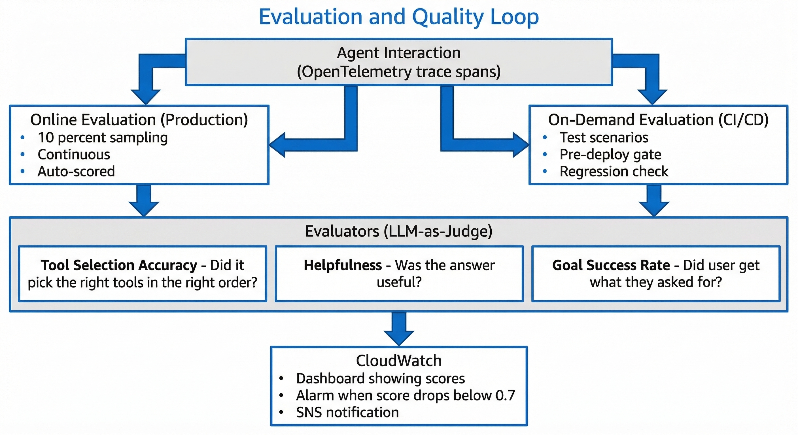

# IoT Telemetry Query Agent — Implementation Plan

## Context

Build an AI agent using **Strands Agents SDK** deployed on **AWS Bedrock AgentCore** that answers natural language questions about IoT telemetry data. The agent must be accurate (chain-of-thought reasoning, tool-delegated math, admit uncertainty), cost-efficient (prompt caching, memory for past queries), and continuously validated (AgentCore evaluations). It should also be extensible via self-creating tools.

---

## High-Level System Architecture


The agent runs inside a **Bedrock AgentCore Runtime** (serverless microVM) and connects to three AWS services: **Bedrock Claude LLM** (with prompt caching), **AgentCore Memory** (short-term session + long-term semantic/episodic), and **AgentCore Evaluations** (online + on-demand) feeding into CloudWatch. The agent's tool registry contains API tools, utility tools, and meta tools for self-extension. External connectivity is via HTTPS to the IoT Telemetry API.

---

## Request Flow — How a Query Gets Answered


A user query flows through 6 stages:
1. **Memory Hook (before)** — retrieves relevant past context from semantic + episodic memory
2. **Agent Reasoning (CoT)** — plans the tool execution chain step-by-step
3. **Tool Execution Chain** — calls tools in sequence (date utils → API query → calculator)
4. **Response Generation** — formats the answer with reasoning
5. **Memory Hook (after)** — saves the interaction for future context
6. **Evaluation (async)** — 10% of interactions are scored by LLM-as-Judge evaluators

---

## Memory Architecture


**Short-term memory** stores raw conversation turns within a session. **Long-term memory** auto-extracts two types of knowledge:
- **Semantic Strategy** — factual mappings (asset type IDs, tag names, user preferences)
- **Episodic Strategy** — interaction patterns with intent, tools used, and outcomes

On new queries, semantic search retrieves relevant facts and episodes, injecting them into the agent's context to skip redundant discovery steps.

---

## Evaluation & Quality Loop



Agent interactions produce OpenTelemetry trace spans that feed into two evaluation paths:
- **Online (Production)** — 10% continuous sampling, auto-scored
- **On-Demand (CI/CD)** — test scenarios as a pre-deploy gate

Both paths use three LLM-as-Judge evaluators: Tool Selection Accuracy, Helpfulness, and Goal Success Rate. Scores are published to CloudWatch with alarms on quality drops.

---

## Caching Strategy


Three caching layers minimize cost:
1. **Bedrock Prompt Cache** (~75% token savings) — caches system prompt, tool definitions, and conversation history prefixes
2. **Application LRU Cache** — caches metadata API responses (asset types, assets) for 1 hour; telemetry data is NOT cached
3. **Memory as Semantic Cache** — recalled facts skip discovery API calls, saving ~2 calls + ~500 tokens per query

---

## Project Structure

```
iot-telemetry-agent/
├── PLAN.md
├── pyproject.toml
├── requirements.txt
├── agent.py                        # AgentCore runtime entrypoint
├── config.py                       # Env config (API base URL, region, model ID)
├── system_prompt.py                # System prompt constant
├── diagrams/                       # Architecture diagrams
├── tools/
│   ├── __init__.py
│   ├── telemetry_api.py            # 6 API tools (list/get assets, types, raw/aggregated data)
│   ├── calculator.py               # Math operations tool
│   ├── date_utils.py               # Date validation, range computation, current date
│   └── data_analysis.py            # Summarize telemetry, compare periods
├── hooks/
│   ├── __init__.py
│   └── memory_hooks.py             # AgentCore Memory HookProvider
├── tests/
│   ├── test_tools.py               # Unit tests per tool
│   ├── test_agent_integration.py   # Full agent integration tests
│   └── eval/
│       ├── test_scenarios.json     # Evaluation test cases
│       └── run_evaluations.py      # On-demand evaluation runner
└── scripts/
    ├── setup_memory.py             # Create AgentCore memory resource
    ├── setup_evaluations.py        # Create online evaluation config
    └── deploy.sh                   # agentcore configure + deploy
```

---

## Phase 1: Foundation

**Files:** `pyproject.toml`, `requirements.txt`, `config.py`, `tools/calculator.py`, `tools/date_utils.py`

- Scaffold project with dependencies: `strands-agents`, `strands-tools`, `bedrock-agentcore`, `bedrock-agentcore-starter-toolkit`, `requests`, `pytest`
- `config.py` — load env vars: `TELEMETRY_API_BASE_URL`, `TELEMETRY_API_KEY`, `MODEL_ID`, `MEMORY_ID`, `AWS_REGION`
- `tools/calculator.py` — `@tool calculator(expression: str) -> str` using safe `eval` with math module. System prompt will enforce the agent always delegates math here
- `tools/date_utils.py` — three tools:
  - `get_current_date()` — returns today in YYYY-MM-DD
  - `validate_date_range(date_from, date_to)` — checks format, ordering, max 1-year span
  - `compute_date_range(period: str)` — converts "last 7 days", "this month", "Q1 2025" etc. to concrete date_from/date_to

## Phase 2: API Tools

**File:** `tools/telemetry_api.py`

Six `@tool`-decorated functions, each wrapping one API endpoint:

| Tool | Endpoint | Key params |
|------|----------|------------|
| `list_assets` | `GET /api/v1/assets/` | optional org_id, asset_type, location filters |
| `get_asset` | `GET /api/v1/assets/<id>/` | `asset_id` |
| `list_asset_types` | `GET /api/v1/asset-types/` | none |
| `get_asset_type` | `GET /api/v1/asset-types/<id>/` | `asset_type_id` |
| `query_raw_data` | `POST /api/v1/raw-data/` | assetTypeId, tagIds (max 20), dateFrom, dateTo, optional assetIds/orgIds |
| `query_aggregated_data` | `POST /api/v1/aggregated-data/` | assetTypeId, tags (id+aggregation, max 20), dateFrom, dateTo, timeSpan, optional assetIds/orgIds |

Each tool:
- Has a descriptive docstring explaining when to use it (critical for tool selection accuracy)
- Validates inputs before calling (date range ≤1yr, max 20 tags)
- Returns structured JSON strings
- Handles API errors gracefully, returning clear error messages

## Phase 3: System Prompt & Agent Assembly

**Files:** `system_prompt.py`, `agent.py`

### System Prompt (`system_prompt.py`)

Key sections:
1. **Chain-of-thought enforcement** — "Before answering, always reason step-by-step: what is being asked, what data is needed, which tools to call in what order"
2. **Never hallucinate** — "If unsure, say so. Never invent asset IDs, tag names, or values"
3. **Delegate math** — "ALWAYS use calculator tool for ANY math. Never compute in-context"
4. **Data discovery workflow** — ordered steps: identify asset type → discover tags → identify assets → query data → analyze
5. **Response format** — Understanding → Approach → Results → Interpretation
6. **Self-creating tools** — instructions for using `load_tool` as last resort

### Agent Entrypoint (`agent.py`)

```python
from strands import Agent
from strands.models import BedrockModel
from strands.models.bedrock import CacheConfig
from bedrock_agentcore.runtime import BedrockAgentCoreApp

bedrock_model = BedrockModel(
    model_id=MODEL_ID,
    cache_tools="default",                    # cache tool definitions
    cache_config=CacheConfig(strategy="auto"), # cache system prompt + conversation
    region_name=REGION,
)

app = BedrockAgentCoreApp()

@app.entrypoint
def handle_request(prompt, session_id, actor_id):
    agent = Agent(
        model=bedrock_model,
        hooks=[memory_hooks],
        system_prompt=SYSTEM_PROMPT,
        tools=[list_assets, get_asset, list_asset_types, get_asset_type,
               query_raw_data, query_aggregated_data,
               calculator, validate_date_range, get_current_date, compute_date_range,
               summarize_telemetry, compare_periods,
               load_tool, editor, shell],
    )
    return str(agent(prompt))
```

## Phase 4: Memory

**Files:** `scripts/setup_memory.py`, `hooks/memory_hooks.py`

### Memory Resource
Create AgentCore memory with two strategies:
- **Semantic** — stores extracted facts ("Asset type 5 has tags T1=Temperature, T2=Pressure")
- **Episodic** — stores interaction patterns with reflection ("User queried pump temperatures using aggregated data with AVERAGE")

### Memory Hooks (`HookProvider`)
- **On user message**: retrieve relevant past context from semantic + episodic memory via semantic search, inject into conversation
- **On agent response**: save the interaction as a memory event (auto-extraction populates long-term stores)

This means repeat/similar queries skip discovery steps and reuse known asset/tag mappings.

## Phase 5: Data Analysis Tools

**File:** `tools/data_analysis.py`

- `summarize_telemetry(data: str) -> str` — compute summary stats (count, min, max, mean, stddev) per tag from a telemetry JSON blob. Prevents large result sets from overwhelming the context window
- `compare_periods(data_a: str, data_b: str) -> str` — compare two telemetry result sets, output deltas and percentage changes

## Phase 6: Caching

Two layers:
1. **Prompt caching** (already configured in Phase 3) — `cache_tools="default"` + `CacheConfig(strategy="auto")` saves ~75% on repeated token processing
2. **Application-level LRU cache** — `@lru_cache` on `list_asset_types` and `list_assets` responses (1-hour TTL) since metadata rarely changes. Telemetry data is NOT cached

## Phase 7: Evaluations

**Files:** `scripts/setup_evaluations.py`, `tests/eval/test_scenarios.json`, `tests/eval/run_evaluations.py`

### Online Evaluations (continuous, 10% sampling)
- `Builtin.ToolSelectionAccuracy` — did the agent pick the right tools?
- `Builtin.Helpfulness` — was the response useful?
- `Builtin.GoalSuccessRate` — did the agent achieve the user's goal?

### On-Demand Evaluations (CI/CD + development)
Test scenarios covering:
- Multi-step queries (discovery → query → analysis)
- Uncertainty admission (out-of-scope questions, unknown assets)
- Math delegation (verify calculator tool used, not in-context math)
- Edge cases (>1yr date range, >20 tags, empty results)

### CloudWatch Alarms
- ToolSelectionAccuracy < 0.8
- Helpfulness < 0.7
- GoalSuccessRate < 0.6

## Phase 8: Self-Creating Tools

Integrate `load_tool`, `editor`, `shell` from `strands_tools`. System prompt instructs the agent to:
1. Only create new tools when no existing tool suffices
2. Write the tool as a Python file with `@tool` decorator
3. Load it dynamically with `load_tool`
4. Use it to answer the current query

## Phase 9: Testing

- **Unit tests** (`tests/test_tools.py`) — each tool in isolation with mocked HTTP
- **Integration tests** (`tests/test_agent_integration.py`) — full agent with mocked API
- **Evaluation tests** (`tests/eval/`) — on-demand evaluations against test scenarios

### Verification Checklist
- [ ] Agent correctly chains discovery → query → analysis for a multi-step question
- [ ] Agent says "I don't know" for out-of-scope or ambiguous questions
- [ ] Agent uses `calculator` tool for all math (never in-context)
- [ ] Memory recalls past asset/tag mappings on repeat queries
- [ ] Prompt caching reduces token usage on multi-turn conversations
- [ ] Online evaluations report scores to CloudWatch
- [ ] Self-creating tool works for an unexpected scenario

---

## Implementation Order

1. Foundation (config, calculator, date tools)
2. API tools (6 endpoint wrappers)
3. System prompt + agent assembly
4. Memory (resource + hooks)
5. Data analysis tools
6. Caching (prompt + application-level)
7. Evaluations (online + on-demand)
8. Self-creating tools integration
9. Tests + verification
